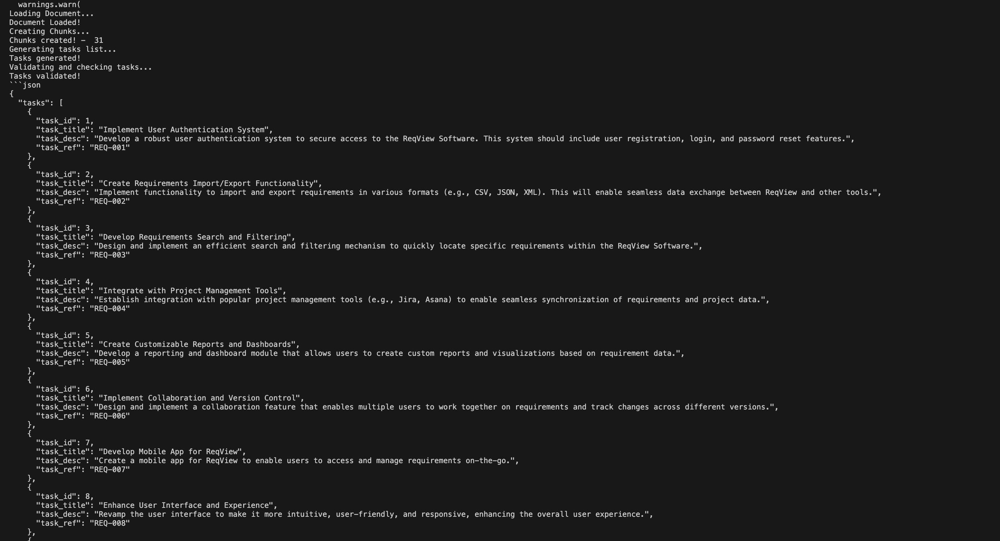

# Task Extractor

## Overview

The Task Extractor is a Python-based tool designed to extract specific development tasks from a Software Requirements Specification (SRS) document in PDF format. It leverages advanced language models and embeddings to process the document, generate actionable tasks, and validate them to ensure they are specific and actionable.

## Method

1. **Load Environment Variables**: The tool loads necessary API keys from environment variables.
2. **Initialize Models and Embeddings**: It initializes the `ChatGroq` language model and `CohereEmbeddings`.
3. **Load and Split PDF**: The PDF document is loaded and split into manageable chunks using `PyPDFLoader` and `RecursiveCharacterTextSplitter`.
4. **Generate Tasks**: A prompt template is used to generate a list of development tasks from each chunk of the document.
5. **Validate and Consolidate Tasks**: The generated tasks are validated, duplicates are removed, and the tasks are organized logically.

## Tools Used

- **Python**: The programming language used to develop the tool.
- **LangChain**: A framework for building applications with language models.
- **ChatGroq**: A language model used for generating tasks.
- **CohereEmbeddings**: Used for creating embeddings from text.
- **PyPDFLoader**: A tool for loading PDF documents.
- **RecursiveCharacterTextSplitter**: Used for splitting documents into chunks.
- **FAISS**: (Commented out in the code) A library for efficient similarity search and clustering of dense vectors.
- **dotenv**: Used for loading environment variables from a `.env` file.

## Usage

1. Ensure you have the required API keys set in your environment variables.
2. Place your SRS document in the specified path.
3. Run the script to extract and validate tasks.

```python
pdf_path = "ReqView-Example_Software_Requirements_Specification_SRS_Document.pdf"
task_extractor = TaskExtractor(pdf_path)
tasks = task_extractor.extract_tasks_from_requirements()
print(tasks.content)
```

This will output a JSON formatted list of specific development tasks extracted from the SRS document.

## smaple Task generated


