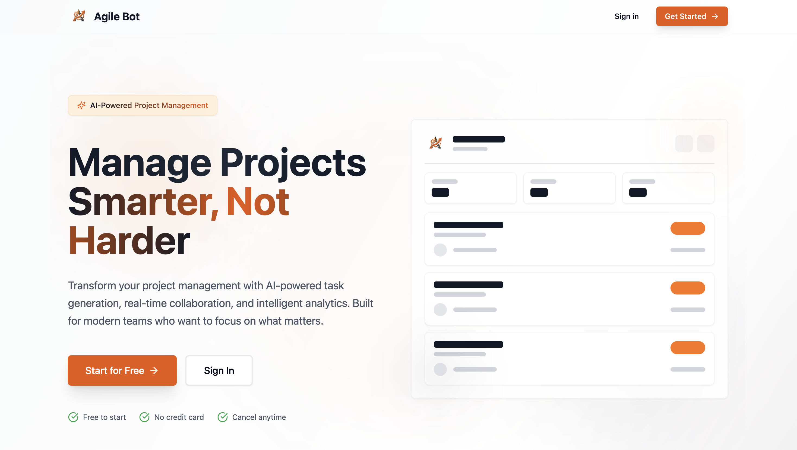
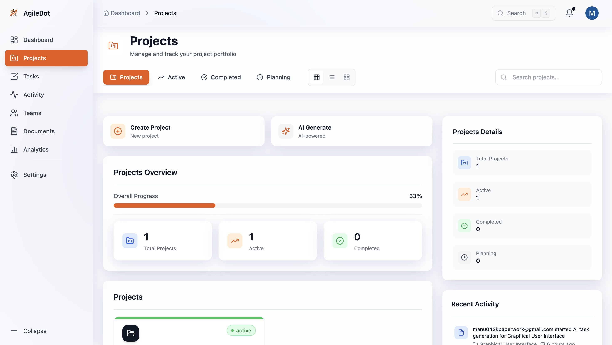
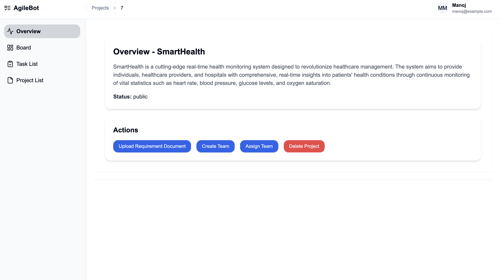
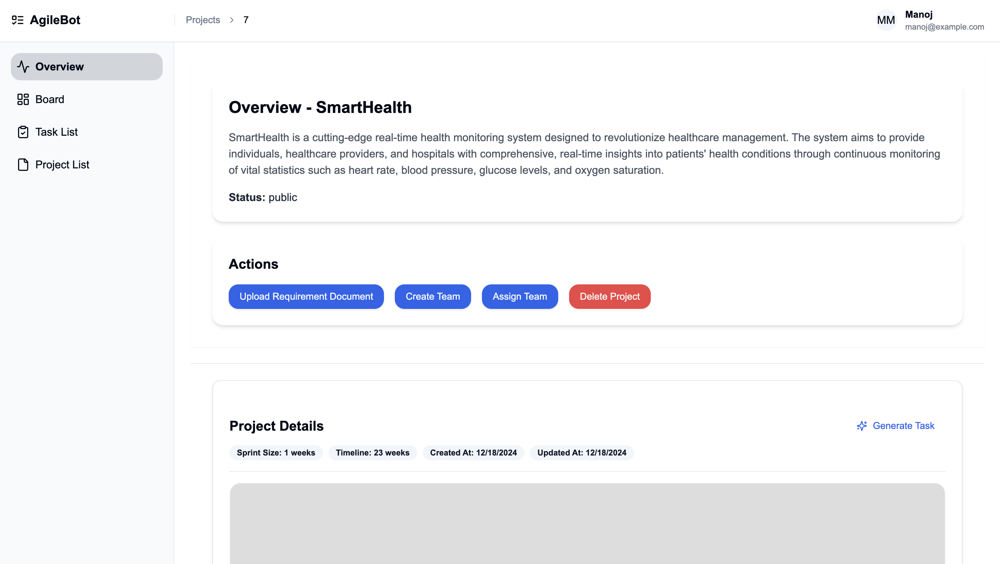
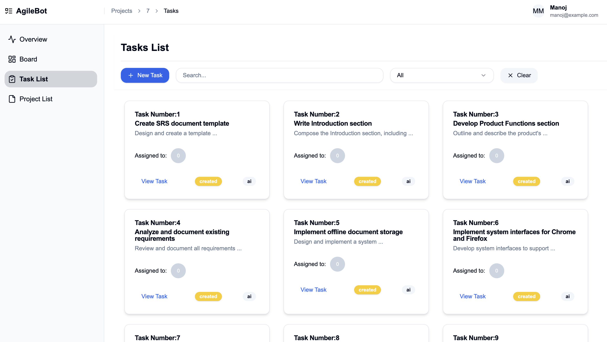
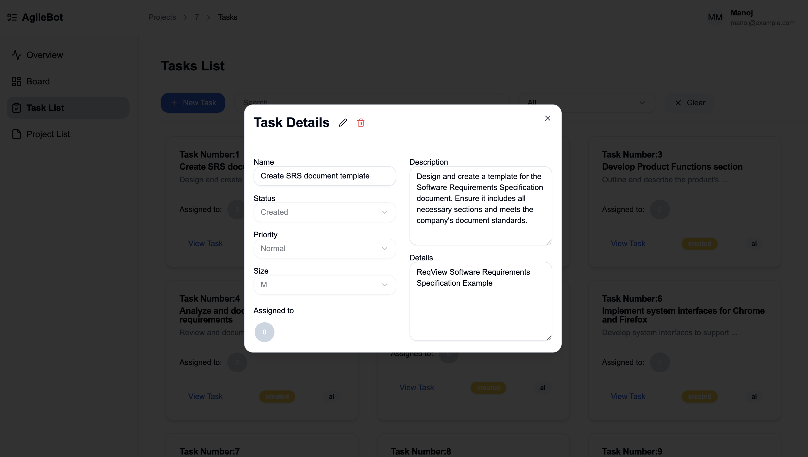
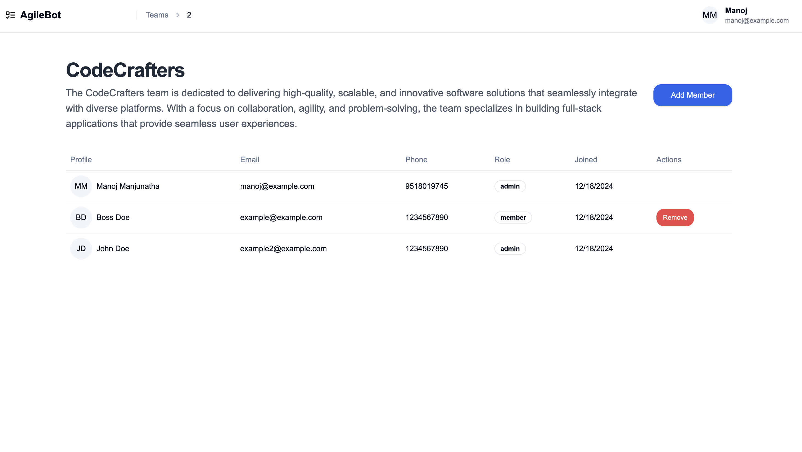
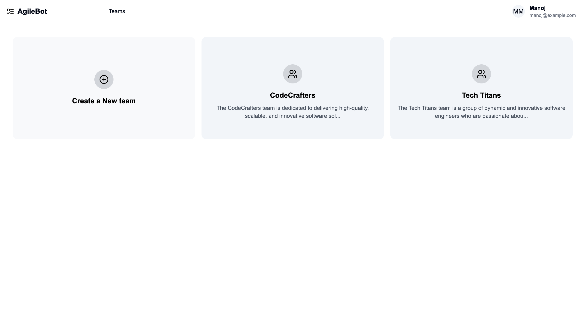

# Agile-bot

Agile-bot is an intelligent SaaS platform designed for Agile project management through advanced automation and AI-driven insights. The platform automatically converts software requirement documents into actionable user stories, validates tasks, and optimizes sprint planning using state-of-the-art AI technologies.

## Overview

This project consists of three main components:
- **Backend**: Django REST Framework API with Celery for asynchronous task processing
- **Frontend**: Next.js application with modern UI components
- **LLM**: AI processing module for document analysis and task generation

## Key Features

### Intelligent Task Management
- **Automated User Story Generation**: Convert software requirement documents (PDF, DOCX) into precise user stories with acceptance criteria
- **AI-Powered Task Validation**: Ensure task accuracy and alignment with project goals using LLM-based validation
- **Sprint Planning**: Streamline project workflows with intelligent task allocation and capacity planning
- **Dependency Detection**: Automatically identify task dependencies and relationships
- **Team Management**: Assign tasks based on team composition and expertise

### Real-time Collaboration
- **WebSocket Support**: Real-time updates for task generation progress
- **Team Invitations**: Email-based team member invitations with role management
- **Live Progress Tracking**: Monitor document processing and task generation in real-time

### Document Processing
- **Multi-format Support**: Process PDF and DOCX requirement documents
- **Vector Embeddings**: Use Qdrant vector database for semantic search and context retrieval
- **Intelligent Parsing**: Extract requirements, user stories, and technical specifications automatically

## Tech Stack

### Backend
- **Framework**: Django 5.0 with Django REST Framework
- **Authentication**: JWT with Google OAuth2 integration
- **Task Queue**: Celery with Redis broker
- **WebSockets**: Django Channels for real-time communication
- **Storage**: Azure Blob Storage (production) / Local filesystem (development)
- **Database**: PostgreSQL (production) / SQLite (development)

### Frontend
- **Framework**: Next.js 14 with React 18
- **UI Components**: Shadcn/ui with Radix UI primitives
- **Styling**: Tailwind CSS with custom animations
- **Authentication**: NextAuth.js with Google OAuth
- **State Management**: React hooks and context
- **PDF Viewing**: React PDF Viewer for document preview

### AI Technologies
- **LLM Inference**: Groq AI (Llama 3.2)
- **Vector Database**: Qdrant for semantic search
- **Embeddings**: Cohere for text embeddings
- **Document Processing**: Docling for document parsing
- **Orchestration**: Google Gemini for task validation

## Project Structure

```
Agile-bot/
├── Backend/              # Django REST API and Celery workers
├── NFrontend/            # Next.js frontend application
├── LLM/                  # AI processing and vector database
├── ScreenShots/          # Application screenshots
└── docker-compose.yml    # Docker orchestration
```

## Quick Start

### Prerequisites
- Docker and Docker Compose
- Python 3.10+
- Node.js 18+
- Redis (for local development)

### Using Docker (Recommended)

1. Clone the repository:
```bash
git clone https://github.com/yourusername/Agile-bot.git
cd Agile-bot
```

2. Set up environment variables:
```bash
# Copy and configure Backend environment
cp Backend/.env.production.template Backend/.env

# Copy and configure Frontend environment
cp NFrontend/.env.production.template NFrontend/.env.local
```

3. Start all services:
```bash
docker-compose up -d
```

4. Access the application:
- Frontend: http://localhost:3000
- Backend API: http://localhost:8000
- API Documentation: http://localhost:8000/api/docs/

### Local Development

See individual README files for detailed setup instructions:
- [Backend Setup](Backend/README.md)
- [Frontend Setup](NFrontend/README.md)
- [LLM Module Setup](LLM/README.md)

## Configuration

### Backend Configuration
Key environment variables in `Backend/.env`:
- `GEMINI_API_KEY`: Required for task validation
- `GOOGLE_OAUTH_CLIENT_ID/SECRET`: For Google authentication
- `REDIS_URI`: Redis connection for Celery and WebSockets
- `USE_AZURE_STORAGE`: Enable Azure Blob Storage for production
- `USE_POSTGRESQL`: Enable PostgreSQL for production

### Frontend Configuration
Key environment variables in `NFrontend/.env.local`:
- `NEXTAUTH_URL`: Application URL
- `NEXTAUTH_SECRET`: Secret for session encryption
- `NEXT_PUBLIC_API_URL`: Backend API endpoint
- `NEXT_PUBLIC_WS_URL`: WebSocket endpoint
- `GOOGLE_CLIENT_ID/SECRET`: Google OAuth credentials

## Deployment

### Production Deployment
The project includes production-ready configurations:
- `docker-compose.prod.yml`: Production Docker setup
- `deploy-celery-azure.sh`: Azure deployment script
- Azure Blob Storage integration
- PostgreSQL database support
- Gunicorn WSGI server
- Nginx reverse proxy ready

### Azure Deployment
1. Configure Azure resources (App Service, Blob Storage, PostgreSQL)
2. Update production environment variables
3. Run deployment script:
```bash
./deploy-celery-azure.sh
```

## API Documentation

Interactive API documentation is available at:
- Swagger UI: http://localhost:8000/api/docs/
- ReDoc: http://localhost:8000/api/redoc/

## Features in Detail

### User Story Generation
1. Upload requirement document (PDF/DOCX)
2. AI processes document and extracts requirements
3. System generates user stories with:
   - Title and description
   - Acceptance criteria
   - Story points estimation
   - Priority level
   - Dependencies
4. Review and edit generated stories
5. Organize into sprints

### Sprint Planning
- Automatic sprint capacity calculation
- Task allocation based on team composition
- Dependency-aware scheduling
- Story point tracking
- Sprint velocity metrics

### Team Management
- Create and manage teams
- Invite members via email
- Role-based access control
- Team capacity planning
- Member expertise tracking

## Screenshots

| Title              | Screenshot                                            |
| ------------------ | ----------------------------------------------------- |
| Landing Page       |          |
| Projects List      |        |
| Project Overview   |  |
| On Document Upload |   |
| Tasks Generated    |    |
| Sample Task        |            |
| Team Info          |                |
| Team Page          |                |


