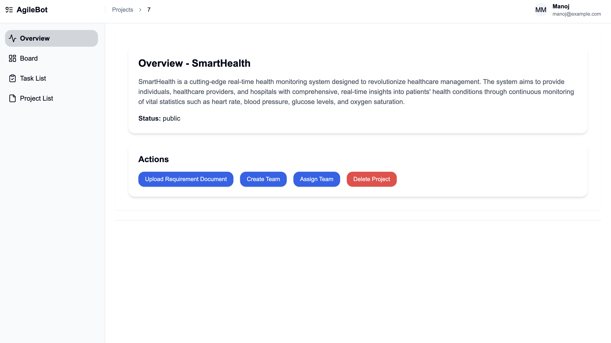
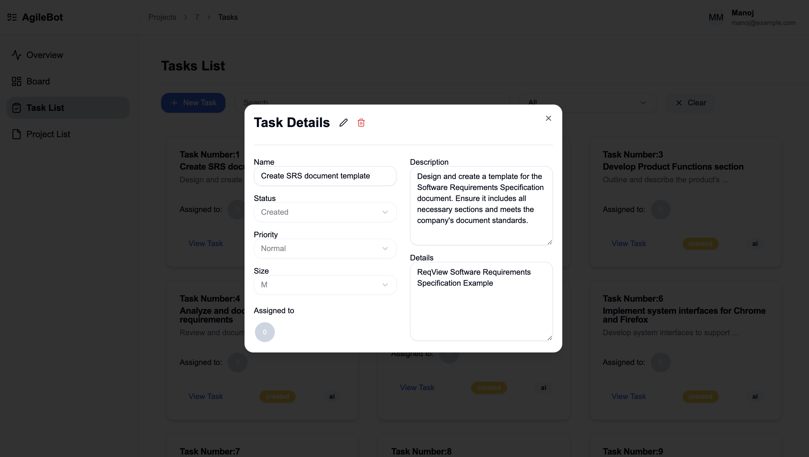

# Agile-bot

Agile-bot is an intelligent SaaS platform designed for Agile project management through advanced automation and AI-driven insights.

## Key Features
### Intelligent Task Management
- **Automated User Story Generation**: Convert software requirement documents into precise user stories
- **AI-Powered Task Validation**: Ensure task accuracy and alignment with project goals
- **Sprint Planning**: Streamline project workflows with intelligent task allocation (Work under progress)

## Tech Stack

- **Backend**: Django DRF
- **Frontend**: React, Shadcn, Tailwind
- **AI Technologies**:
  - LangChain
  - FAISS Vector Database
  - Llama 3.2
  - LLM Inference (Groq AI)
  - Vector Embeddings (Cohere)

## Key Technologies

- **SaaS Platform**: Automated user story generation
- **AI Processing**: Enhanced accuracy through vector embeddings and AI inference
- **Workflow Optimization**: Agent-based task generation and validation

## Screenshots

| Title              | Screenshot                                            |
| ------------------ | ----------------------------------------------------- |
| Landing Page       |          |
| Projects List      |        |
| Project Overview   |  |
| On Document Upload |   |
| Tasks Generated    |    |
| Sample Task        |            |
| Team Info          |                |
| Team Page          |                |
